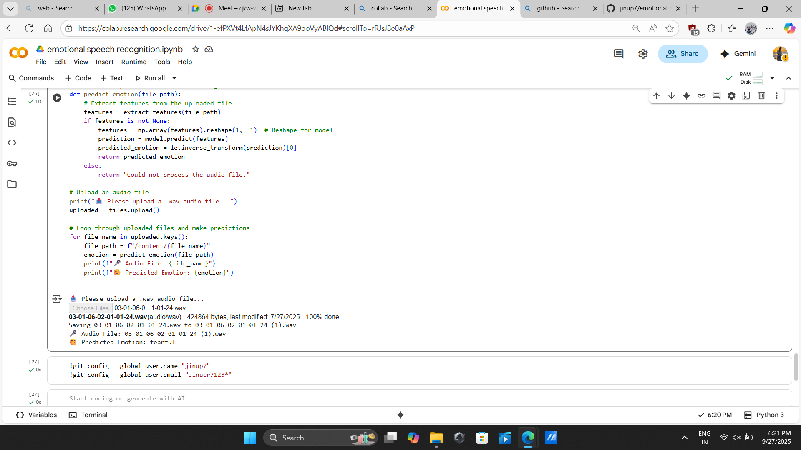

# 🎙️ Speech Emotion Recognition (SER)

This project implements **Speech Emotion Recognition (SER)** using the [RAVDESS dataset](https://zenodo.org/record/1188976).  
It extracts **MFCC (Mel Frequency Cepstral Coefficients)** features from audio files and classifies emotions using a **Multi-Layer Perceptron (MLP)**.

---

## 📂 Project Structure
speech-emotion-recognition/
│── SER_notebook.ipynb        # Colab notebook
│── src/
│   └── emotion_model.py       # Feature extraction & prediction
│── saved_model/               # Trained model (optional)
│── requirements.txt           # Dependencies
│── README.md                  # Project description


---

## 🎯 Features
- Extracts **MFCC features** from audio signals.
- Supports **8 emotions**:
  - Neutral, Calm, Happy, Sad, Angry, Fearful, Disgust, Surprised
- **MLP Classifier** (hidden layers: 256 → 128 → 64).
- Predicts emotion from **uploaded .wav file** in Colab.
- Generates **accuracy score, classification report, and confusion matrix**.

---

## 📊 Dataset
- **RAVDESS (Ryerson Audio-Visual Database of Emotional Speech and Song)**
- 24 professional actors (12 male, 12 female).
- Emotions include **calm, happy, sad, angry, fearful, disgust, surprised, neutral**.

📌 Dataset Link: [Download RAVDESS](https://zenodo.org/record/1188976)

---

## ⚙️ Installation
Clone the repository and install dependencies:
```bash
git clone https://github.com/your-username/speech-emotion-recognition.git
cd speech-emotion-recognition
pip install -r requirements.txt
```

**Dependencies:**
- librosa  
- soundfile  
- numpy  
- scikit-learn  
- matplotlib  
- tensorflow  

---

## 🚀 Usage
### 1. Run in Google Colab
- Open `SER_notebook.ipynb` in Google Colab.  
- Mount Google Drive and set dataset path.  
- Train model and test predictions.  

### 2. Predict Emotion
Upload a `.wav` file and run:
```python
emotion = predict_emotion("your_audio.wav")
print(f"Predicted Emotion: {emotion}")
```

---

## 📈 Results
- Accuracy: ~65–75% (depends on dataset split).  
- Example confusion matrix and prediction output:



---

## 🔮 Future Work
- Add chroma & spectral features.  
- Try CNN / LSTM models for better accuracy.  
- Build a Streamlit web app for live testing.  

---

## 👨‍💻 Author
**JINU P**  
B.Tech AI & Data Science | Excel Engineering College, Erode  
📧 jinudevanp9@gmail.com  
🔗 [LinkedIn](http://linkedin.com/in/jinu-p-b86359255)
